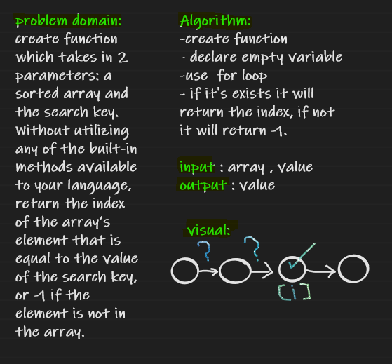

# Binary Search of Sorted Array
create function which takes in 2 parameters: a sorted array and the search key. Without utilizing any of the built-in methods available to your language, return the index of the array’s element that is equal to the value of the search key, or -1 if the element is not in the array.

## Whiteboard Process

## Approach & Efficiency
declare a variable, use  for loop to find if the value exits, if it does it will return the index
if not it will return -1.