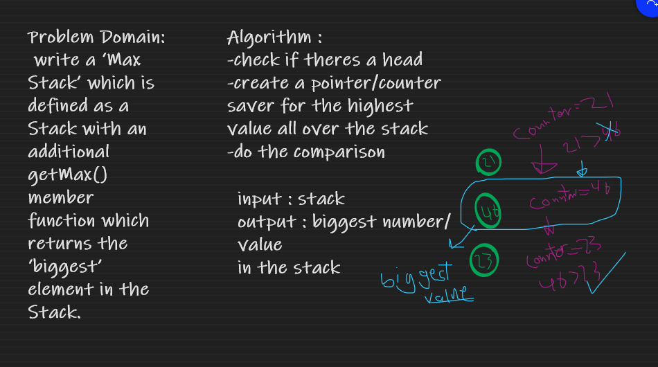

# Challenge Summary

 write a ‘Max Stack’ which is defined as a Stack with an additional getMax() member function which returns the ‘biggest’ element in the Stack.

## API

* pop : Removes the node from the top of the stack
* push : adds a new node with that value to the top of the stack 
* peek : get the value from the of the stack
* isEmpty : check if the stack is empty
* getMax : get the biggest value all over the stack

## Whiteboard Process

## Approach & Efficiency

* getMax

1. Big O(n) for Space.
2. Big O(n) for Time.