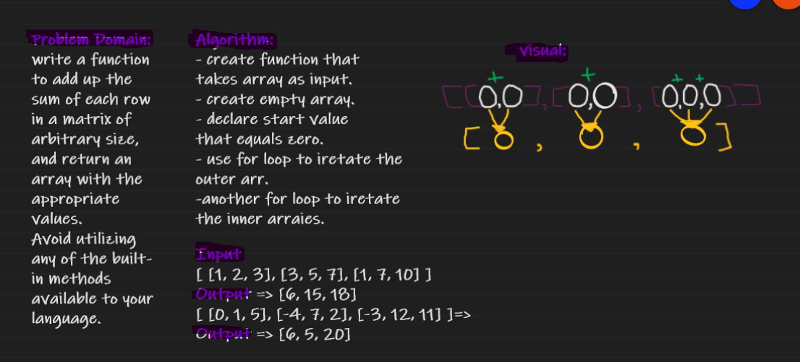

# Matrix - Summation 
write a function to add up the sum of each row in a matrix of arbitrary size, and return an array with the appropriate values.
Avoid utilizing any of the built-in methods available to your language.

## Whiteboard Process

## Approach & Efficiency
create function that takes array as input.create empty array.declare start value that equals zero.
use for loop to iretate the outter arr.another for loop to iretate the inner arraies