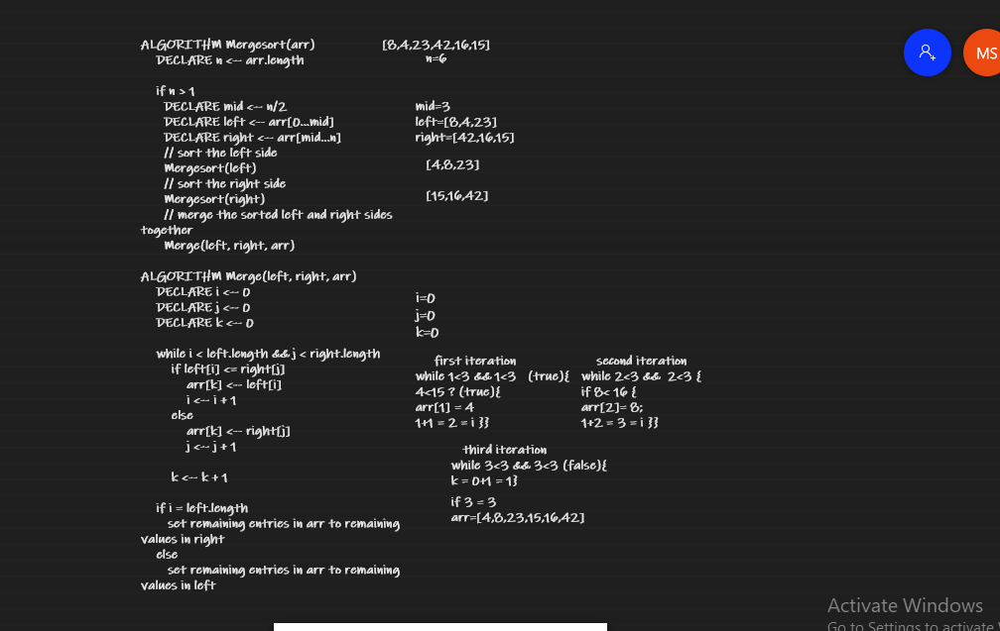
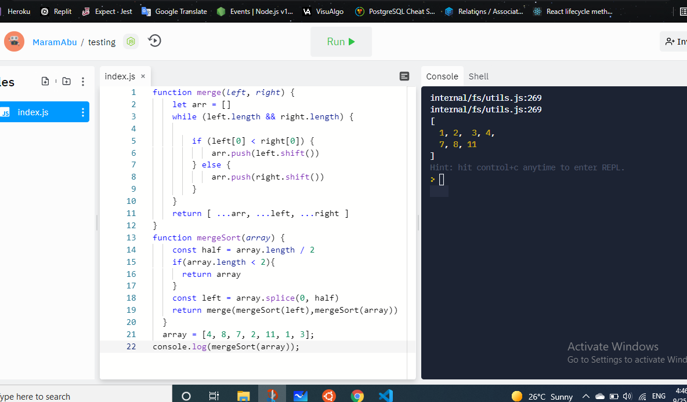

# Challenge Summary

Sorting refers to arranging items of a list in a specific order 

## Whiteboard Process

## Approach & Efficiency

1. Split the given list into two halves (roughly equal halves in case of a list with an odd number of elements).
2. Continue dividing the subarrays in the same manner until you are left with only single element arrays.
3. Starting with the single element arrays, merge the subarrays so that each merged subarray is sorted.
4. Repeat step 3 unit with end up with a single sorted array.

## Test

