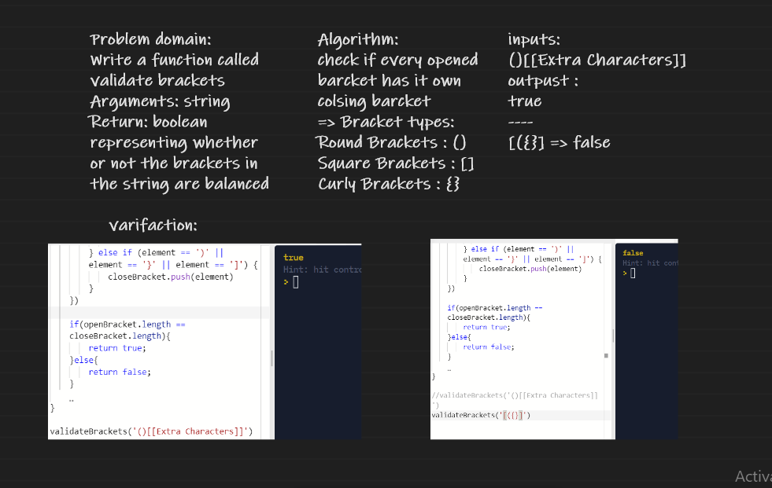

# Challenge Summary
Write a function called validate brackets
Arguments: string
Return: boolean
representing whether or not the brackets in the string are balanced

## Whiteboard Process

## Approach & Efficiency
Big O(n) for Space
Big O(n) for Time
