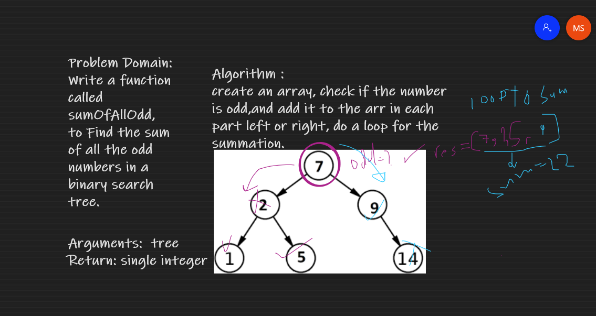

# Challenge Summary

Find the sum of all the odd numbers in a binary search tree.

## Whiteboard Process

## Approach & Efficiency

create an array, check if the number is odd,and add it to the arr in each part left or right, do a loop for the summation.
