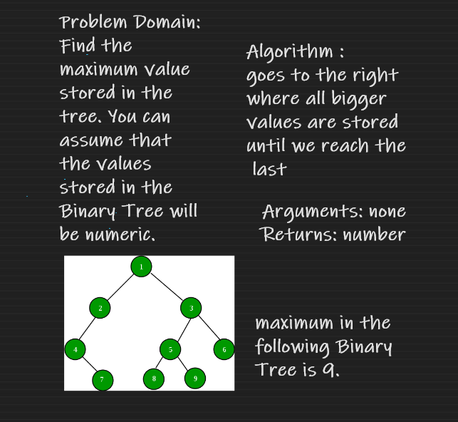

# Challenge Summary

Write the following method for the Binary Tree class
find maximum value
Arguments: none
Returns: number

## Whiteboard Process

## Approach & Efficiency

Find the maximum value stored in the tree. You can assume that the values stored in the Binary Tree will be numeric.
