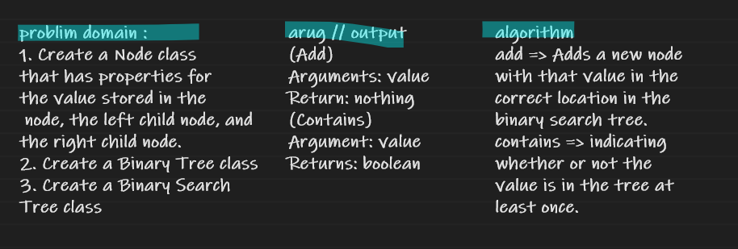

# Challenge Summary

1. Create a Node class that has properties for the value stored in the node, the left child node, and the right child node.
2. Create a Binary Tree class
3. Create a Binary Search Tree class

## API

* Binary Tree : Define a method for each of the depth first traversals:
pre order
in order
post order which returns an array of the values, ordered appropriately.

* Define a method for each of the depth first traversals:
pre order
in order
post order which returns an array of the values, ordered appropriately.

## Whiteboard Process

## Approach & Efficiency

Big O(n) for Space
Big O(n) for Time
